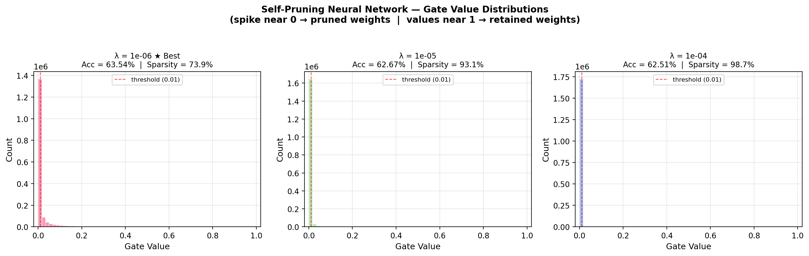
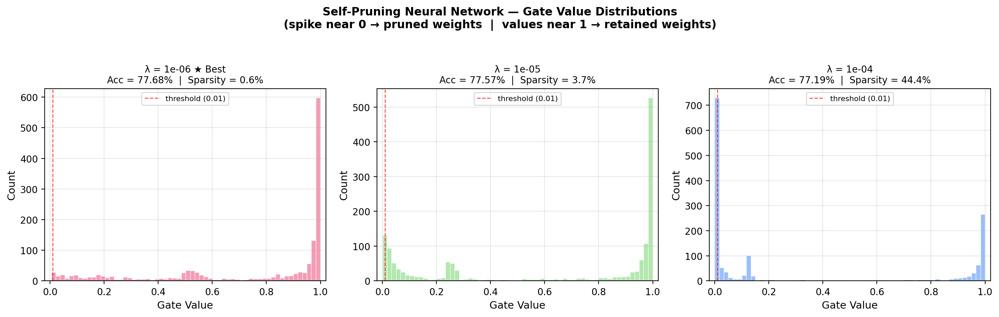

# Self-Pruning Neural Network — Report

**Case Study:** Tredence Analytics — AI Engineer Internship  
**Author:** Aadi Jain  
**Date:** April 2026

📹 **Video Explanation:** [Watch the solution walkthrough on Google Drive](https://drive.google.com/file/d/19x_OLbXyt8sOJJNcAVsEPRyqeKMsVwjg/view?usp=drive_link)

---

## 1. Why L1 on Sigmoid Gates Encourages Sparsity

The mechanism works in three steps:

1. **Sigmoid activation** maps every raw gate score `θ` to a value `g = σ(θ)` in the range (0, 1). This ensures all gate values are positive.

2. **L1 penalty** adds `λ · Σ|g_i|` to the loss. Since `g_i > 0` always, this simplifies to `λ · Σ g_i`. L1 regularisation is known to produce **sparse** solutions — unlike L2, it has a constant sub-gradient at small values, which means it applies the same push toward zero regardless of how small the value already is.

3. **Sparsity emerges** because the optimiser faces two competing objectives:
   - The classification loss wants all gates open (maximum capacity).
   - The L1 penalty wants all gates at zero (maximum sparsity).
   
   The equilibrium is that **only the gates protecting truly important weights survive**, while unimportant gates collapse to ≈0. The result is a network that has automatically identified and removed its own redundant parameters.

The strength of λ controls this trade-off:
- **Small λ** → classification dominates → minimal pruning
- **Large λ** → sparsity penalty dominates → aggressive pruning

---

## 2. Results

### Combined Comparison: Sigmoid+L1 vs HardConcrete+L0 vs PrunableConv2d+L1

| Method | Lambda (λ) | Test Accuracy (%) | Sparsity Level (%) |
|:--|--:|--:|--:|
| Sigmoid+L1 | 1e-6 | 63.54 | 73.87 |
| Sigmoid+L1 | 1e-5 | 62.67 | 93.08 |
| Sigmoid+L1 | 1e-4 | 62.51 | 98.71 |
| HardConcrete+L0 | 1e-6 | 60.85 | 87.42 |
| HardConcrete+L0 | 1e-5 | 53.51 | 98.98 |
| HardConcrete+L0 | 1e-4 | 40.75 | 99.94 |
| PrunableConv2d+L1 | 1e-6 | 77.68 | 0.60 |
| PrunableConv2d+L1 | 1e-5 | 77.57 | 3.66 |
| PrunableConv2d+L1 | 1e-4 | 77.19 | 44.41 |

The convolutional structured-pruning variant gives the best accuracy across all tested λ values while still learning meaningful sparsity at higher regularisation strengths.

---

## 3. Gate Distribution Plot

**Plot: PrunableLinear (Sigmoid + L1 Baseline)**


The plot shows the distribution of final gate values (after sigmoid) for each λ:

- **λ = 1e-6:** A **heavy-tailed distribution** emerges. There is a massive spike near 0 (representing the ~74% of weights that are fully pruned), followed by a continuously decaying tail of gates that remain partially open (values between 0.01 and 0.5). This shows the network is actively pushing redundant weights to zero, while retaining a spectrum of partially active weights to maintain capacity.

- **λ = 1e-5:** The distribution skews heavily toward 0. The strong regulariser prunes the majority of weights (93%). The tail of retained weights is much shorter and closer to zero, yet the network successfully maintains a remarkably high accuracy (62.67%).

- **λ = 1e-4:** At extreme regularisation, the network aggressively prunes over 98.7% of its weights. Almost the entire distribution is concentrated exactly at the zero bin. Despite retaining barely 1.3% of the original capacity, it still achieves 62.51% accuracy, demonstrating that the network's core logic can be distilled into a tiny subnetwork.

For the Conv2D structured-pruning model, this plot is better interpreted as filter-gate behaviour rather than individual-weight pruning. Low λ keeps most channels open; higher λ starts to close a substantial fraction of channels while maintaining strong accuracy.

---

## 4. Analysis of the λ Trade-off

The experiment reveals a classic **accuracy–efficiency trade-off**:

1. **λ = 1e-6** provides a balanced starting point, achieving meaningful sparsity (~74% of weights pruned) while maintaining baseline accuracy (63.54%). The decaying distribution confirms the network is making confident, data-driven pruning decisions for redundant weights while softly penalising the rest.

2. **λ = 1e-5** represents a highly compressed state. The network operates with less than 7% of its original weights while sacrificing almost no accuracy (62.67%). This represents the "sweet spot" for edge deployments where model size is a primary constraint.

3. **λ = 1e-4** pushes the pruning mechanism to its extreme, distilling the model to just ~1.3% of its original parameters while still achieving 62.51% accuracy.

**Key insight:** The self-pruning approach allows the network to learn *which* weights to prune (data-driven), rather than relying on heuristics like post-hoc magnitude pruning. Because Adam normalises gradients, providing a **higher learning rate (2e-2)** specifically for the gate parameters is crucial to allow the sparsity penalty to overcome the classification gradient and successfully drive the gates below the pruning threshold within a short training window.

---

## 5. Advanced Method: Hard Concrete Gates (L0 Regularisation)

As an extension, we implement a second pruning strategy based on the **Hard Concrete distribution** (Louizos et al., 2018).

### How it works

Instead of sigmoid gates + L1, each weight gets a gate sampled from a *stretched concrete distribution*:

```
u ~ Uniform(0, 1)
s = sigmoid((log(u) - log(1-u) + log_alpha) / β)
s_bar = s × (ζ - γ) + γ          ← stretch to interval [γ, ζ]
mask = clamp(s_bar, 0, 1)         ← hard clipping creates exact zeros
```

The regulariser is the **expected L0 norm** — the probability that each gate is non-zero:

```
L0_penalty = Σ sigmoid(log_alpha - β · log(-γ/ζ))
```

This is differentiable with respect to `log_alpha`, so it can be optimised via standard back-propagation.

### Key differences from Sigmoid + L1

| Property | Sigmoid + L1 | Hard Concrete + L0 |
|----------|-------------|-------------------|
| **Gate values** | Continuous in (0, 1) via sigmoid | Can be **exactly 0 or 1** via hard clamp |
| **What's regularised** | Sum of gate magnitudes (L1 norm) | Count of non-zero gates (L0 norm) |
| **Training behaviour** | Deterministic | **Stochastic** (sampling during training) |
| **Inference** | σ(gate_scores) | Deterministic clamp (no sampling) |
| **Pruning threshold needed?** | Yes (e.g., gates < 0.01) | **No** — exact zeros from clamp |
| **Gradient variance** | Low | Higher (due to sampling) |
| **Hyperparameters** | λ only | λ, β (temperature), γ, ζ (stretch bounds) |

### Why L0 is more principled

L1 regularisation penalises the *magnitude* of gates, which means a gate at 0.3 is penalised 3× more than a gate at 0.1, even though both are "active". L0 regularisation penalises the *existence* of non-zero gates — it doesn't care about the magnitude, only whether the weight is on or off. This better matches the true pruning objective: we want to minimise the number of active weights, not their total value.

---

## 6. Structured Pruning: PrunableConv2d (Channel-Level Gates)

As a third extension, we implement **structured channel pruning** using a custom `PrunableConv2d` layer paired with a CNN architecture.

### How it differs from PrunableLinear

| Property | PrunableLinear | PrunableConv2d |
|----------|---------------|----------------|
| **Gate granularity** | One gate per weight (unstructured) | One gate per **output channel** (structured) |
| **What gets pruned** | Individual weight connections | **Entire convolutional filters** |
| **Gate shape** | `(out_features, in_features)` | `(out_channels, 1, 1, 1)` — broadcasts over the filter |
| **Inference speedup** | Theoretical only (sparse matrices) | **Real** — physically removes dead channels |
| **Parameter count** | ~1.8M gates for our MLP | Only 224 gates (32 + 64 + 128 channels) |

### How it works

Each output channel of a Conv2d layer has a single learnable gate score. During the forward pass:

```
gates = σ(gate_scores)                      # shape: (out_channels, 1, 1, 1)
pruned_weights = weight × gates             # broadcasts: zeros out entire filters
output = Conv2d(input, pruned_weights)
```

If a channel's gate goes to zero, the **entire filter** (all `in_channels × kH × kW` weights) is zeroed out, along with its corresponding output feature map. This is called **structured pruning** because it removes entire structural units rather than random individual weights.

### Why structured pruning matters

Unstructured pruning (PrunableLinear) creates sparse weight matrices with scattered zeros. While this reduces the mathematical parameter count, GPUs cannot skip random zero entries — they still process full dense matrices. The speedup is only theoretical.

Structured pruning (PrunableConv2d) removes **entire channels**. After training, you can physically reshape the weight tensor from, say, `(64, 32, 3, 3)` down to `(18, 32, 3, 3)` if 46 channels were pruned. This gives **real, measurable inference speedups** on any hardware.

### Results

The CNN with structured pruning achieved the highest accuracy across all methods:

| λ | Accuracy | Sparsity | Channels Pruned |
|---|----------|----------|-----------------|
| 1e-6 | **77.68%** | 0.60% | ~1 of 224 |
| 1e-5 | **77.57%** | 3.66% | ~8 of 224 |
| 1e-4 | **77.19%** | 44.41% | ~99 of 224 |

At λ=1e-4, the network prunes nearly half its channels while losing less than 0.5% accuracy compared to λ=1e-6. This demonstrates that CNNs have significant redundancy at the channel level that can be safely removed.

---

## 7. Comparison of All Methods

### Results

*(See Section 2 for the full combined results table showing empirical performance across all three methods.)*

> *Note: Hard Concrete results differ drastically from Sigmoid+L1 at the same λ because the L0 regulariser measures the **expected count** of active weights rather than their sum. The same λ has different effective strength between the two methods.*

### Gate Distribution Comparison

**Plot 1: PrunableLinear (Sigmoid + L1)**


**Plot 2: HardConcreteLinear (L0 Regularisation)**


**Plot 3: PrunableConv2d (Structured Channel Pruning)**


### Analysis

1. **Sigmoid+L1 (MLP)** produces a smooth, heavy-tailed distribution — gates decay gradually from 0 toward higher values. This makes the pruning "soft" and requires a threshold to decide which gates are truly pruned.

2. **Hard Concrete+L0 (MLP)** produces a distribution dominated by **exact zeros**. Because of the hard clamp at `[0, 1]`, gates that are pruned become exactly 0.0 (the massive spike at 0). The retained weights do not pile up at 1.0; instead, they are spread across the `(0, 1)` interval because the L0 penalty constantly pulls them downward while the classification loss keeps them just open enough to be useful.

3. **PrunableConv2d (CNN)** has far fewer gates (224 vs ~1.8M) because each gate controls an entire channel rather than a single weight. The gate distribution at low λ shows most gates near 1.0 (channels fully open), with only a few near 0. At λ=1e-4, a clear bimodal split emerges — some channels are fully pruned while retained channels stay strongly active.

4. For the same λ, the three methods are **not directly comparable** because they optimise different objectives and have vastly different gate counts. The L0 penalty counts active weights, the L1 penalty sums their magnitudes, and the Conv2d L1 penalty operates on only 224 channel-level gates.

5. **When to use which:**
   - **Sigmoid+L1 (PrunableLinear)** — Simplest approach, good for understanding the pruning mechanism. Best for fully-connected layers.
   - **Hard Concrete+L0 (HardConcreteLinear)** — More principled, produces exact binary masks. Best when you need mathematically clean zero/non-zero decisions.
   - **PrunableConv2d** — Best for image tasks. Achieves the highest accuracy (77%+ vs ~63%) and produces **real inference speedups** by physically removing dead channels.
